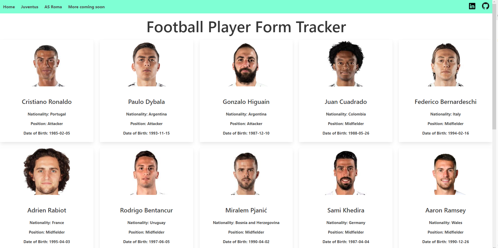
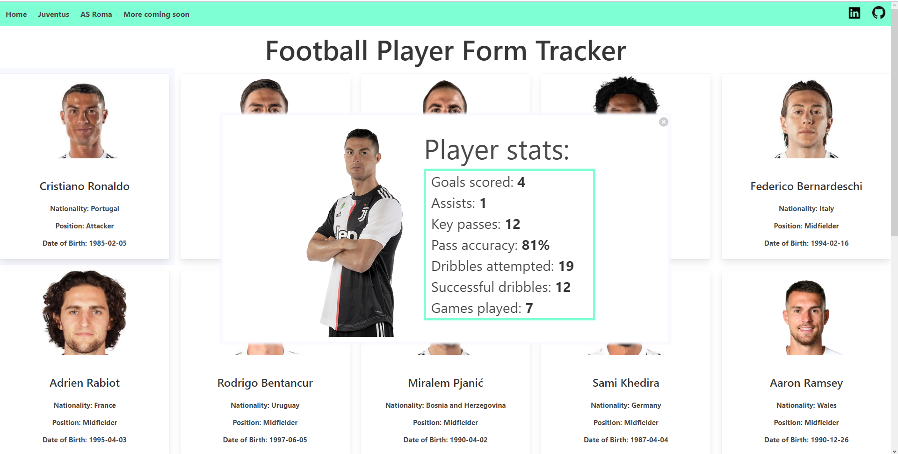

Requirements to run:
- Node 10+
- Yarn 1.1+

View the project on GitHub Pages here: https://dominikzig.github.io/form-tracker/

**Functionality:**

This project allows you to see a football player's form for the current season (currently only for Juventus squad players).

**Technical Info:**

The project uses React with TypeScript and modern techniques such as React Hooks.
It makes use of Bulma CSS framework for styling and Yarn for building and dependency management.
To display the player data, it makes use of two APIs: Football Data (https://www.football-data.org)
and API Football (https://www.api-football.com). The project is using the free and development versions 
respectively and thus is quite limited in the amount of requests which can be sent at any one time.
Unfortunately, it also means that the data itself can be quite outdated as it is not
updated as frequently as the paid versions of these APIs.


Once you have the prerequisites installed, in order to run the application locally, in your terminal, run the command:
```yarn start```

**Screenshots:**

Squad list example:


Individual player stats example:

